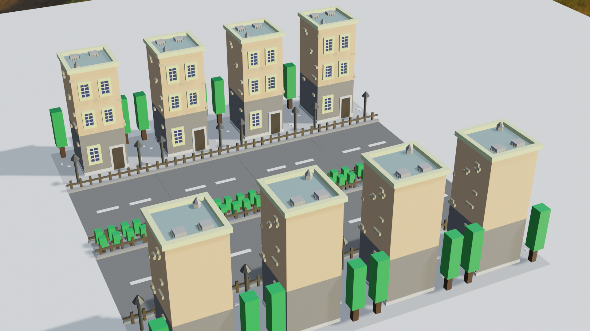
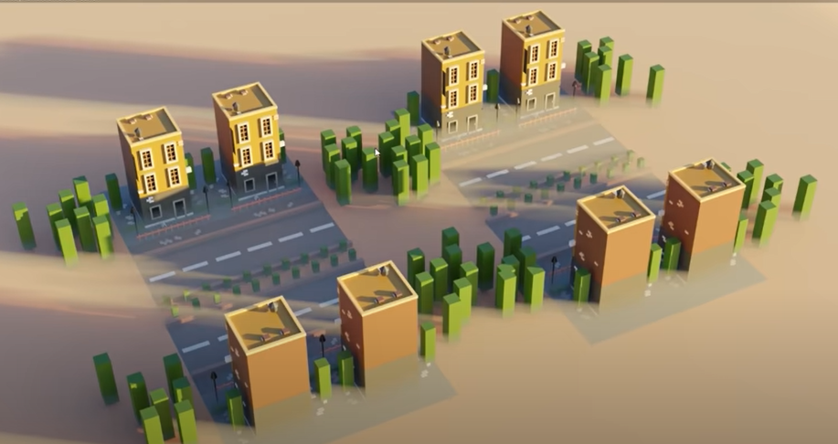

# Purpose

## Definition

Create a low-poly city using blender with only basic transformations and primitives, in accordance with [this video](https://www.youtube.com/watch?v=At9qW8ivJ4Q&list=PLgO2ChD7acqH5S3fCO1GbAJC55NeVaCCp&index=2&ab_channel=CrossMindStudio)

## Task List

In the definition of the following, it's helpful to remember how we want to separate objects with respect to the texture we plan on assigning to them. This project isn't meant to go deep into textures right now so all we'll be doing is assigning a base color to the textures.

1. Define Blender scene
1. Add HDR background
1. Define floor plane
1. Define road
   1. Define road dividing line
1. Define fence
1. Define building
   1. Define foot
   1. Define roof
   1. Define lower building
   1. Define upper building
   1. Define window
   1. Define bricks
   1. Define rooftop contents
   1. Define building door
   1. Define building ground floor window
1. Define lamp posts
1. Define trees
1. Define bushes
1. Create render

# What the end result looks like

# What the end result should look like (roughly)

